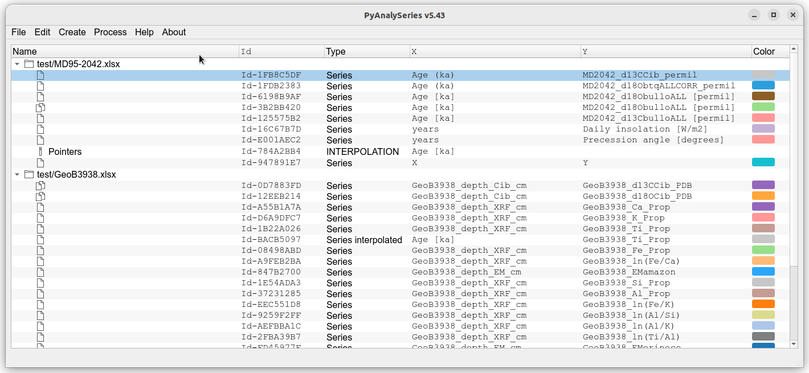
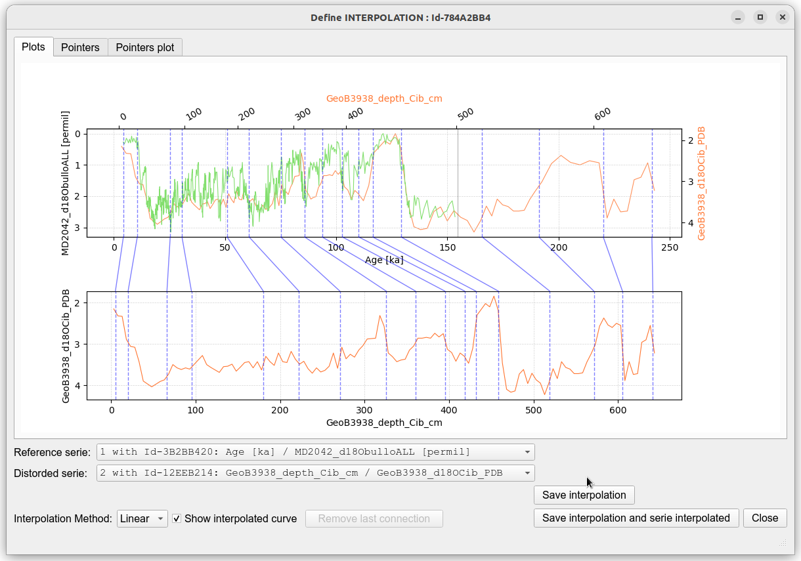

## PyAnalySeries

PyAnalySeries Reimagined: A Legacy Tool Reborn

  
[](https://doi.org/10.5281/zenodo.15238092)

**PyAnalySeries** is a Python application built on **matplotlib**, with a **PyQt-based graphical interface**, making it easily portable across platforms including **Linux**, **macOS**, and **Windows**.  
It is designed as a modern continuation of the <a href="https://github.com/PaleoIPSL/AnalySeries" target="_blank">**AnalySeries**</a>, the original application on MacOS, aiming to reproduce its core functionalities within a more robust and portable Python environment.  
Special attention has been given to **ergonomics**, emphasizing **simplicity** and **clarity**, while offering intuitive interactivity such as **zooming**, **panning**, and **scrolling**, with **linked or independent axis**.  
The core design follows a **"Define then Apply"** workflow for data processing operations such as **filtering**, **sampling**, and **interpolation**.  
Documents are read and saved in an **open format** spreadsheet (xlsx) with **multiple worksheets** for organization. It is also possible to import series or pointers directly from the **clipboard**, following a simple **copy (Ctrl+C)** and **paste (Ctrl+V)** operation from an external spreadsheet.  
The application leverages **robust, well-tested modules** for interpolation, notably **SciPy**, and features an **interactive interface** for defining **interpolation pointers** (formerly known as *Linage* and *Splinage*), allowing for **precise placement and manipulation**—either directly on data points or independently.  

Based on: numpy, pandas, matplotlib, scipy, shapely, openpyxl, PyQt

Conception and developments : Patrick Brockmann LSCE/CEA - IPSL

This project is distributed under the **CeCILL v2.1** license.  


<hr style="border:2px solid gray">

#### Reference  
Hevia-Cruz, F., Brockmann, P., Govin, A., Michel, E., and Paillard, D. (2025). Reviving AnalySeries: PyAnalySeries, a modern and collaborative open-source tool for time-series analysis. Past Global Changes Magazine, 33(2), 74–75. [https://doi.org/10.22498/pages.33.2.74](https://doi.org/10.22498/pages.33.2.74)

<hr style="border:2px solid gray">

#### Documentation 
The use of the application is detailed in the following [Wiki page](https://github.com/PaleoIPSL/PyAnalySeries/wiki).

<hr style="border:2px solid gray">

#### Tutorials
 
Tutorials can be found from the [Wiki page](https://github.com/PaleoIPSL/PyAnalySeries/wiki)

 * [Tutorial 01](https://github.com/PaleoIPSL/PyAnalySeries/wiki/Tutorial-01)
 * [Tutorial 02](https://github.com/PaleoIPSL/PyAnalySeries/wiki/Tutorial-02)

<hr style="border:2px solid gray">

#### Installation

#### Requirements

- Conda / Miniconda

The provided environment file installs all dependencies, including:
- Python 3.12
- PyQt6

⚠️ macOS:
PyQt6 requires macOS ≥ 13 (Ventura).

##### Get the application

 * `git clone https://github.com/PaleoIPSL/PyAnalySeries`
 * `cd PyAnalySeries`

##### Update the application

For end users, the local repository is not intended to contain personal developments.
The recommended update procedure is to reset the application to the latest official version.

Before updating, make sure to save any personal files stored in the `PyAnalySeries` directory.

```
cd PyAnalySeries
git fetch origin
git reset --hard origin/main
```

##### Create a python environment to use PyAnalySeries 

 * `conda env create --file environment.yml`
 * `conda env list`
 * `conda activate env_PyAnalySeries`

>  🚨 **BREAKING CHANGE – CONDA ENVIRONMENT RESET REQUIRED**
>
> The application now uses **PyQt6 (Qt6)** and **Pyleoclim**.
> The existing Conda environment created with **PyQt5** is **not compatible**.
>
> **If you already created `env_PyAnalySeries`, you must delete and recreate it.**
>
> ```bash
> conda deactivate
> conda env remove -n env_PyAnalySeries
> conda env create --file environment.yml
> conda activate env_PyAnalySeries

##### Test

 * `python PyAnalySeries.py`
 * `python PyAnalySeries.py test/ws_ex.xlsx`
 * `python PyAnalySeries.py test/MD95-2042.xlsx test/GeoB3938.xlsx`

##### Icon and shortcuts 

 * Icon : 
 * Shortcut on Linux :
 	* Copy the `misc/PyAnalySeries.desktop` file to your Desktop, and make change to specify YOURLOGIN
 	* Make change in the `PyAnalySeries.sh` file to specify the anaconda installation directory
	* Set an icon on the shorcut by choosing the `resources/PyAnalySeries_icon.png` file as icon

 * Shortcut on MacOS :
 	* Use Automator tool to set a shortcut (choose new application and execute shell)
	* Copy in the shell the PyAnalySeries.sh file content with correct anaconda path
	* Save as an application in your Desktop directory
	* Set an icon by pressing **⌘ + I** on the shorcut created and drag the `resources/PyAnalySeries_icon.svg` file on the top icon 

 * Shortcut on Windows
	* Right-click on Desktop → **New → Text Document**
    * Rename to `run_pyanalyseries.bat` (⚠️ ensure `.bat`, not `.txt`)
    * Edit the file and paste:
      ```@echo off
         call conda activate env_PyAnalySeries
         cd /d C:\Users\YOUR_USERNAME\PyAnalySeries
         python PyAnalySeries.py
         pause
      ```
	* Save the file
	* Right-click the `.bat` file → **Create shortcut**
	* Move the shortcut to Desktop
	* Double-click the shortcut to launch PyAnalySeries
	* Windows does **not support SVG icons** → convert to `.ico`
	* Right-click shortcut → **Properties → Change Icon**
	* Select your `.ico` file

#### Captures

 


 

<hr style="border:2px solid gray">

#### Releases

See [releases.md](./releases.md) for release details.
